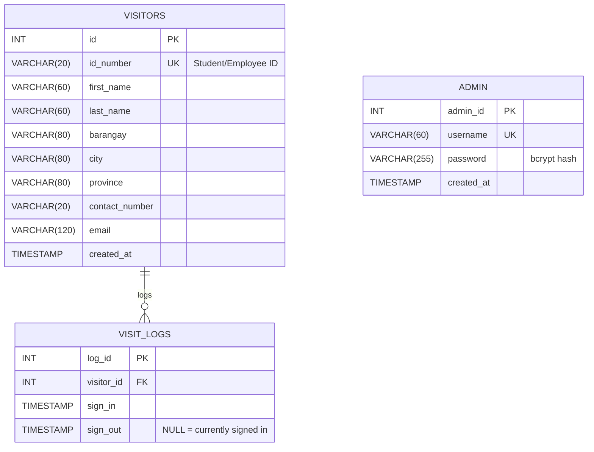

# Entity Relationship Diagram (ERD)

This document describes the database schema for the **CpE Registry — Contact Tracing App**.

### Table Details:
1. **`visitors`**: Stores the core registration details of each individual. The address is segmented into `barangay`, `city`, and `province` to allow precise filtering by the admin. `id_number` is unique to prevent duplicate registrations.
2. **`visit_logs`**: Tracks every visit instance. It links to `visitors` via `visitor_id`. A visit is active if `sign_out` is `NULL`.
3. **`admin`**: Stores the system administrators. The `password` must always be hashed.
